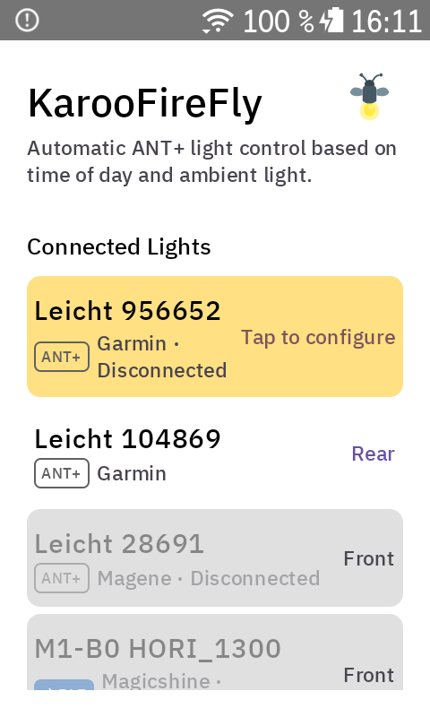
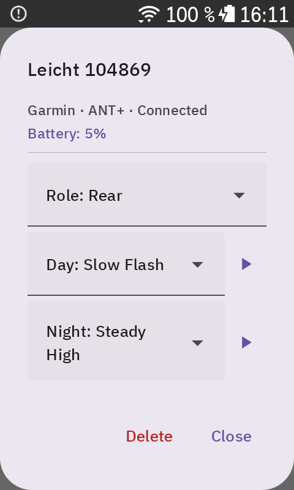
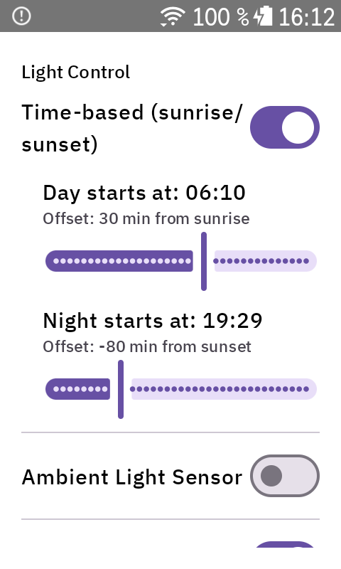
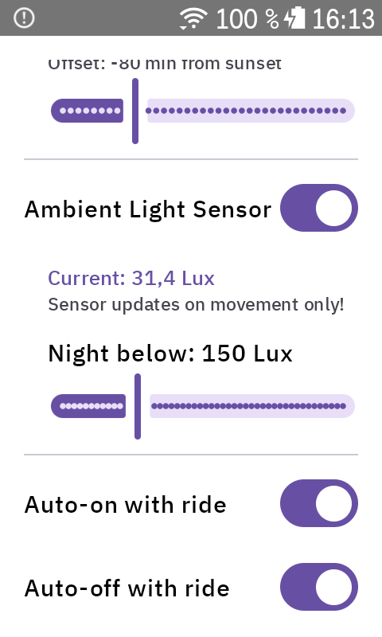

<p align="center">
  
</p>

# KarooFireFly

ANT+ & Bluetooth Smart Bike Light Controller for Hammerhead Karoo 3.

> **Early Development / Use at Your Own Risk**
>
> This extension uses an undocumented internal Karoo API that may break with firmware updates. Use at your own risk.

## Overview

Controls ANT+ and Bluetooth bike lights from your Karoo. Unlike Karoo's built-in light support which only toggles on/off at ride start/stop, KarooFireFly sets specific light modes based on time of day and ambient light conditions.

**Supported Lights:**

| Light | Protocol | Status |
|-------|----------|--------|
| Magene L508 | ANT+ | ✅ Tested |
| Garmin Varia RTL 515/516 | ANT+ | ✅ Tested |
| Magicshine Hori 1300 | BLE | ✅ Tested |
| Magicshine EVO 1700 | BLE | Supported (untested) |
| Garmin Varia UT800 / HL500 | ANT+ | Should work (untested) |
| Bontrager Ion / Flare RT | ANT+ | Should work (untested) |
| Any ANT+ smart bike light | ANT+ | Should work if paired through Karoo |

**Features:**
- **Multi-protocol support** — ANT+ lights via Karoo pairing, Magicshine BLE lights via direct Bluetooth
- Per-light configuration with protocol-specific modes (tap any light to configure)
- Independent feature switches: Time-based and Ambient Light Sensor (enable one or both)
- Automatic light mode switching based on time of day (sunrise/sunset with configurable offsets)
- Ambient light sensor mode switching (Karoo 3's built-in lux sensor)
- Combined mode: time-based baseline with ambient sensor override (e.g. tunnels)
- Two zones: Day and Night with clear "Day starts at" / "Night starts at" times
- Zone change notifications with sound during rides (configurable)
- Auto on/off with ride start/stop, optional auto-off on pause
- Battery level and temperature readout for Magicshine BLE lights
- Test buttons to preview light modes from settings
- BonusActions mappable to AXS shift buttons or Karoo hardware buttons:
  - **Toggle Lights** — turns all lights on/off
  - **Cycle Mode** — cycles through configured profiles (Off → Day → Night → Off)

## How It Works

### ANT+ Lights
Pair your ANT+ lights through **Karoo's native sensor settings** (Settings > Sensors). KarooFireFly discovers them automatically.

### Magicshine BLE Lights
KarooFireFly discovers Magicshine lights via Bluetooth when you open the settings. Supported models (M1/M2 series) appear automatically. Tap to configure and the extension connects.

### Light Configuration
Tap any light in the Connected Lights section to open its detail dialog. Assign a role (Front/Rear), configure Day and Night modes, and use the test buttons to preview. All changes auto-save.

## Settings

### Connected Lights

Discovered lights are shown with protocol badges (ANT+/BLE), manufacturer, and connection status. New unconfigured lights are highlighted. Tap any light to configure.

<p align="center">
  
  
</p>

### Light Detail Dialog

Each light has its own configuration dialog with:
- Role assignment (Front / Rear)
- Day and Night mode selection with protocol-specific modes
- Test buttons to preview each mode for 3 seconds
- Battery level and temperature (BLE lights)
- Delete option to remove configuration

**ANT+ modes:** Off, Steady High, Steady Low, Slow Flash, Fast Flash

**Magicshine modes:** Off, Steady/Flash/SOS at 10%, 25%, 50%, 100%

### Light Control

Enable one or both features independently via switches:

| Feature | Description |
|---------|-------------|
| **Time-based (sunrise/sunset)** | Automatic mode switching at configurable times relative to sunrise/sunset |
| **Ambient Light Sensor** | Automatic mode switching based on Karoo 3's built-in lux sensor |

When both are enabled, time-based acts as the baseline and the ambient sensor can only darken the zone (e.g. tunnel detection). When neither is enabled, lights only respond to BonusButton presses.

<p align="center">
  
  
</p>

### Zone Change Notifications

When enabled, an in-ride alert with sound is shown whenever the light zone changes (e.g. DAY → NIGHT). The notification shows the reason and the resulting light modes per light.

### Manual Override

When using an auto mode, BonusButton presses temporarily override the automatic control. The override clears automatically when the light zone changes or when the ride state changes (pause/stop).

## Architecture

### Layers

1. **Karoo Integration** (`karoo/`) — SensorService AIDL binding, ANT+ light mode commands
2. **BLE** (`ble/`) — Magicshine BLE scanning, connection, protocol implementation
3. **Light** (`light/`) — `LightController` interface abstracting ANT+ and BLE
4. **Engine** (`engine/`) — State machine, sunrise/sunset calculation, ambient light sensor
5. **Data** (`data/`) — DataStore settings, per-light profiles, light assignments
6. **Extension** (`KarooLightControllerExtension.kt`) — KarooExtension service, entry point
7. **UI** (`ui/`) — Jetpack Compose settings screen with inline light detail dialogs

### State Machine (priority high to low)

1. **Manual Override** — BonusAction pressed, holds until zone change or ride state change
2. **Auto Mode** — Zone determined by configured control mode:
   - *Time-based:* sunrise/sunset with configurable offsets (±3 hours)
   - *Ambient Light:* lux sensor with smoothing (10s moving average) and hysteresis (10s dwell time)
   - *Combined:* time-based baseline, sensor can darken but not brighten (e.g. tunnel → NIGHT)
3. **Ride State** — Lights off when ride ends (optionally on pause)

## Development Setup

### 1. JDK 17

```bash
brew install openjdk@17
```

Or install via [Android Studio](https://developer.android.com/studio) which bundles a JDK.

### 2. Android SDK

Either install [Android Studio](https://developer.android.com/studio) (recommended), or the command line tools only:

```bash
brew install --cask android-commandlinetools
sdkmanager "platforms;android-35" "build-tools;35.0.0"
```

Make sure `ANDROID_HOME` is set (Android Studio sets this automatically):

```bash
export ANDROID_HOME=~/Library/Android/sdk
```

### 3. GitHub Packages credentials

The karoo-ext SDK is hosted on GitHub Packages. Create a [GitHub personal access token](https://github.com/settings/tokens) with `read:packages` scope, then add to `~/.gradle/gradle.properties`:

```properties
gpr.user=YOUR_GITHUB_USERNAME
gpr.key=YOUR_GITHUB_TOKEN
```

## Build & Deploy

```bash
./gradlew assembleDebug
adb install app/build/outputs/apk/debug/app-debug.apk
```

## Dependencies

- `io.hammerhead:karoo-ext:1.1.8` — Karoo Extension SDK
- `no.nordicsemi.kotlin.ble:client-android:2.0.0-alpha02` — Nordic BLE Client
- `ca.rmen:lib-sunrise-sunset:1.1.1` — Sunrise/sunset calculation
- `androidx.datastore:datastore-preferences` — Settings persistence
- `androidx.compose.material3:material3` — UI
- `com.jakewharton.timber:timber` — Logging

## Important Notes

- Extension ID: `karoo-light-controller` (no `.` allowed in karoo-ext IDs)
- Pair ANT+ lights through **Karoo's native sensor settings**, not through the extension
- Magicshine BLE lights are discovered automatically when settings are open or a BLE light is configured
- BLE connection requires Bluetooth permissions (granted on first launch)

### Undocumented Karoo API Warning

This extension controls ANT+ lights through Karoo's **internal SensorService AIDL interface** (`LightCommandConnectionAIDL`). This is not a public API — it was reverse-engineered from the SensorService APK.

**Why:** Karoo blocks `setRfFrequency()` for third-party apps, making it impossible to open ANT+ channels directly. The only way to control ANT+ lights is through Karoo's own SensorService, which already has an active ANT+ connection to paired lights.

**How it works:** The extension binds to the SensorService, retrieves the `LightCommandConnection` sub-binder via AIDL transaction 17, then calls `setLightMode` (transaction 3) with a `LightMode` Parcelable loaded via reflection from the SensorService's classloader.

**Risk:** Karoo firmware updates may change AIDL transaction codes, parameter formats, or class internals. If the extension stops working after a firmware update, the `KarooLightControl.kt` file is the place to investigate.
